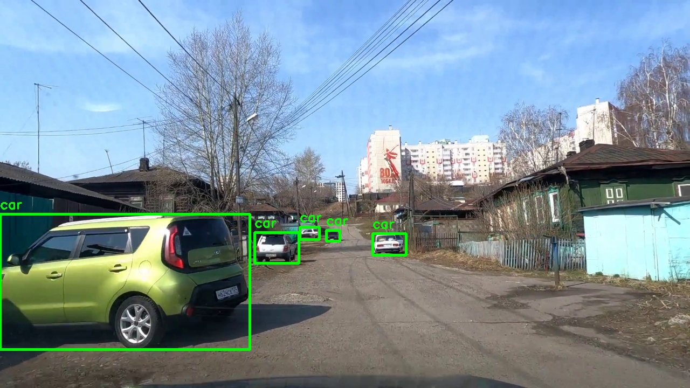

# Car Detection Dataset — Krasnoyarsk (2025)

A custom dashcam image dataset for **single-class car detection**.  
The project is developed for educational and research purposes, with the goal of learning dataset creation, annotation, and preparation for object detection models.

---

## Project Description

The dataset contains manually and semi-automatically annotated frames extracted from dashcam videos recorded in the city of **Krasnoyarsk (Russia)** in 2025.

All annotations follow the **YOLO format** and cover a single object class:

- **`car` — passenger vehicles only**

Image resolution: **1280 × 720**

---

## Why Only One Class?

The dataset is annotated for a single class: **passenger cars**.

This decision was made because the project is intended as a learning exercise, and the total dataset size is currently small (~500 images including planned future additions).

Focusing on one homogeneous class:

- allows the model to learn more effectively  
- improves detection accuracy  
- avoids class imbalance  
- keeps the project manageable for experimentation  

In future versions, more classes may be added once the dataset becomes larger and more diverse.

---

## Dataset Structure

```
car-det-krsk-2025/
├── datasets/
│   └── cvat_2025/
│       ├── images/        # 96 JPG images
│       └── labels/        # YOLO .txt files (one per image)
└── README.md
```

Each annotation file has the format:

<class_id> <x_center> <y_center> <width> <height>

All values are normalized to the range 0–1.

---

### Example of Annotated Image (CVAT)


---

## Sources

As part of the project to build a custom dataset, short dashcam videos were taken from the VKontakte social network.  
The recordings were published by the channel author **“Регистратор Россия”** and captured in **Krasnoyarsk** in 2025, showing various city districts and streets.

The material is used **solely for educational and non-commercial purposes**.

**Source links:**  
https://vkvideo.ru/video-229664279_456239017
https://vkvideo.ru/video-229664279_456239063
https://vkvideo.ru/video-229664279_456239041
https://vkvideo.ru/video-229664279_456239067
https://vkvideo.ru/video-229664279_456239043
https://vkvideo.ru/video-229664279_456239039
https://vkvideo.ru/video-229664279_456239065
https://vkvideo.ru/video-229664279_456239031
https://vkvideo.ru/video-229664279_456239071
https://vkvideo.ru/video-229664279_456239076
https://vkvideo.ru/video-229664279_456239079
https://vkvideo.ru/video-229664279_456239081
https://vkvideo.ru/video-229664279_456239084
https://vkvideo.ru/video-229664279_456239121
https://vkvideo.ru/video-229664279_456239093
https://vkvideo.ru/video-229664279_456239094
https://vkvideo.ru/video-229664279_456239108
https://vkvideo.ru/video-229664279_456239131
https://vkvideo.ru/video-229664279_456239133
https://vkvideo.ru/video-229664279_456239132
https://vkvideo.ru/video-229664279_456239137
https://vkvideo.ru/video-229664279_456239136
https://vkvideo.ru/video-229664279_456239129
https://vkvideo.ru/video-229664279_456239130
https://vkvideo.ru/video-229664279_456239127
https://vkvideo.ru/video-229664279_456239126
https://vkvideo.ru/video-229664279_456239122
https://vkvideo.ru/video-229664279_456239120
https://vkvideo.ru/video-229664279_456239115
https://vkvideo.ru/video-229664279_456239112
https://vkvideo.ru/video-229664279_456239103
https://vkvideo.ru/video-229664279_456239097
https://vkvideo.ru/video-229664279_456239089
https://vkvideo.ru/video-229664279_456239086
https://vkvideo.ru/video-229664279_456239083
https://vkvideo.ru/video-229664279_456239072
https://vkvideo.ru/video-229664279_456239042
https://vkvideo.ru/video-229664279_456239037
https://vkvideo.ru/video-229664279_456239030
https://vkvideo.ru/video-229664279_456239023
https://vkvideo.ru/video-229664279_456239022
https://vkvideo.ru/video-229664279_456239025

---

## Future Plans

- Add additional subsets annotated using different tools (Label Studio, Roboflow, LabelImg) 
- Expand dataset to 300–500+ images
- Train baseline models (YOLO, RT-DETR)  
- Publish evaluation results

- ---

## License

MIT

---

## Contact

Created by **odarapara-ml**  
For educational purposes.
